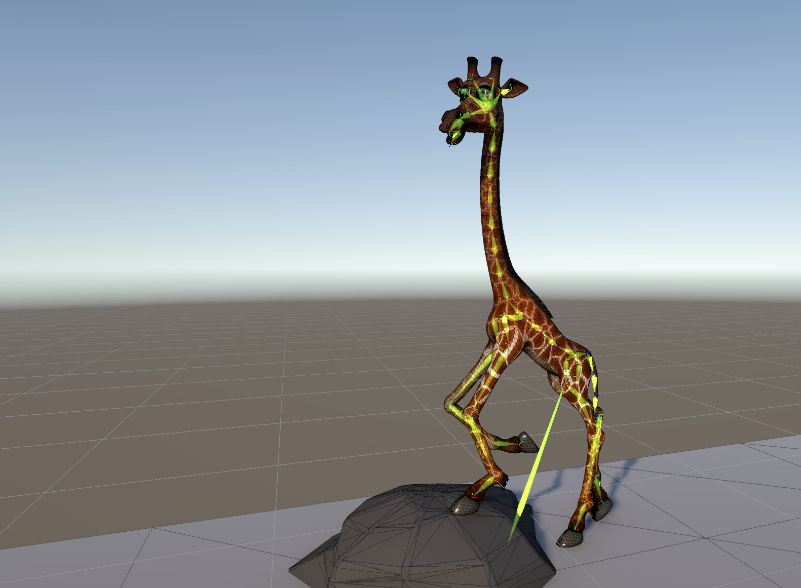
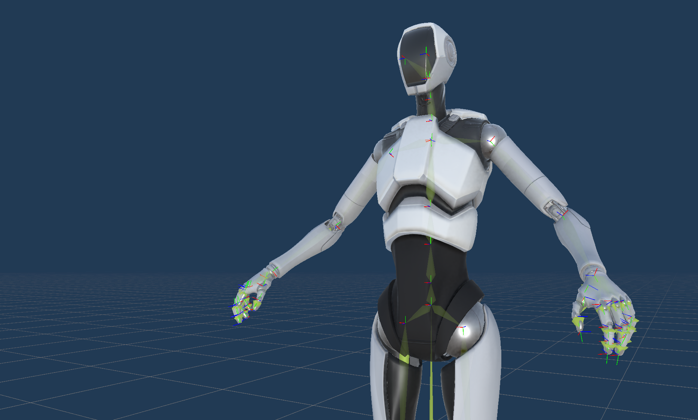
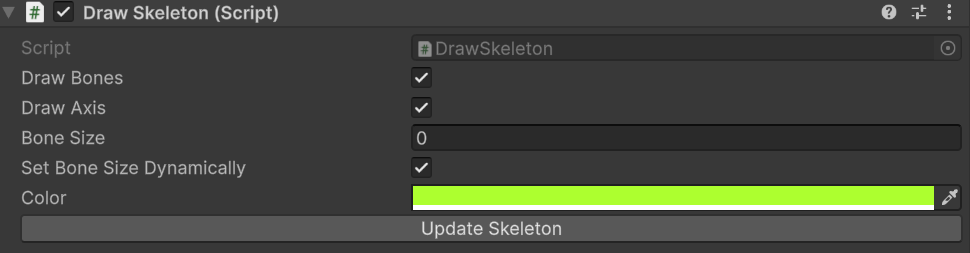

# Overview
This allows for the drawing of bones (both a visualisation of the bones themselves
as well as their axis) for a prefab which contains skinnedMeshComponents.

## Set Up
Simply place the **DrawSkeleton.cs** in your scripts folder of your project and the
**DrawSkeletonEditor.cs** in the Editor folder of your Unity project. 

## Applying & Using
Select an **gameobject** and choose to **Add Component** and add the `DrawSkeleton` 
monobehaviour. You should immediately see the skeletal hierarchy drawn in the 
viewport (note you need to have gizmo drawning enabled).

## Features

By default it will attempt to automatically resolve a good "thickness" for the bones,
however if you want to override that you can by disabling the `Set Bone Size 
Automatically`. 

You can also specify the colour of the bones as well as whether the bones should 
draw at all. Finally you can also specify whether the local axis of the bones should
be drawn.

If you make hierarchical changes to your skeleton (especially if you're doing this
procedurally), then you will need to update the skeleton draw. You can do this from
within the inspector by clicking "Update Skeleton". 